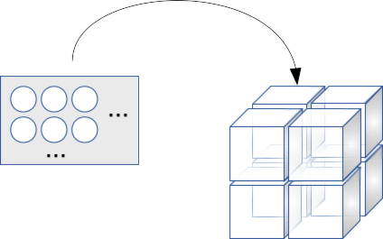

# Containers

Samples can be added to a number of different containers, which can be extended by your plugins.

## Audit

Just like with samples, no container will ever be deleted. Instead, they get a new version every time you change them. When a sample is added to a container, we record which version it was originally added to, so it's easy to answer how the container looked like when the sample was originally added.

## Dimensions

Containers can have 2 or 3 dimensions, supporting e.g. tubes (2D), plates (2D) and freezers (3D).

## Add a sample to a container

When a sample is first created via the high-level API, it is not in a container. One can add it to one like this:

TODO

I think it could be helpful here to have an API that looks more like this:

```
a = Sample("A")
plate = Container("c", rows=8, cols=12)
plate[ContainerPosition(row="A", column="1")] = a
```

Since I think it would drastically reduce the confusion about what is what with regards to column/row.

/JD 2019-05-20

```
a = Sample("A")
plate = Container("c", rows=8, cols=12)
plate["A1"] = a
```

This will create a `Location` entity for the sample. The system keeps track of all locations of all samples in any version. Let's take a look at an ancestry tree expanded with location data:


Changing the sample creates a new version of it.

```
a.volume = 100.0
```

Now both point to the same location:


Now, let's move the sample, note that the previous version still remembers where it was:

```
plate.move("A1", "B2")
```


## Add a container to another container

Containers can be added to other containers, e.g. plates in a freezer. Here we split a freezer into two columns and add the plate to it:

```
plate = Container("c", rows=8, cols=12)
freezer = Container("freezer 1", rows=3, cols=2)
freezer.add(plate, row=1, col=1)
```

## Deeper nesting of containers

You can nest containers deeper if you want to. Here for example, we define each shelve in the freezer so we can position each plate according to depth in the freezer too (3D):

```
freezer1 = Container("freezer1", rows=2, cols=1)
shelve1 = Container("freezer1/shelve1", rows=2, cols=2)
freezer1.add(shelve1, row=1)
shelve2 = freezer1.create_child("shelve1", rows=2, cols=2)  # Creates a container with the name "freezer1/shelve2"

# The previous line works because containers add children by default by the rule DOWN rather than
# RIGHT or DEPTH
```

This means that you can easily fetch a particular shelve by name, but at the cost of more setup. Compare this to 3D containers which are simpler.


## 3D containers

Instead of adding shelves to our container, we can also use the third positional parameter, `depth`. These are available in any container but set to one by default.

```
freezer = Container("freezer", rows=2, cols=2, depth=2)
freezer.add(plate, row=1, col=1, depth=2)
```



# Representation in the database

Each container will have an entry in the database table `clims_container`.

The relation between containers and samples (and other `Item`s) is in the table `clims_location`. These are the most important fields in that table:

- item_id: Points to the item that is saved at this location
- item_orig_version: The version the item was at when it was added
- container_id
- container_orig_version: The version the container was at when the item was added to it
- row
- column
- depth

Note that location always points to the latest version of the container and the item in question. But for audit reasons, we keep the original versions around too. This is a theme in the architecture Common LIMS: Every question about the origin and placement of a sample or container must be easily answerable.
