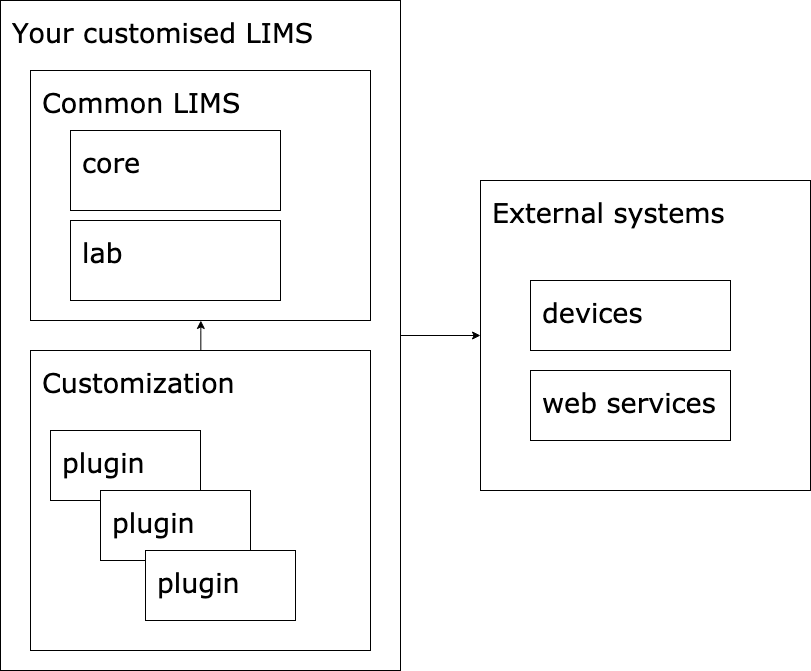

# Modularity

Common LIMS is a framework to create custom LIMS systems in a consistent and simple way. Several attempts have been made at making LIMS systems that can be used by several different organizations, but no reference implementation has emerged yet.

The approach behind Common LIMS is to assume that it will be used in wildly different organizations. To approach this, we split the system in three sections:

    * Core
    	* Addresses features you would expect from any information system
    	* Related UI components
    * Lab
    	* Provides APIs for features that are common amongst most or all labs
    	* Related UI components
    * Plugins
    	* Custom code



All workflows and custom code are defined in plugins. These plugins allow different instances of the system to behave differently. For example different sequencing facilities might have different sequencing instruments and workflows. Since these components are defined by the plugins, CommonLIMS is able to accomodate a wide variety of setups.

CommonLIMS pluggins are Python packages, and can thus easily be shared via Python's package repository or on GitHub.

Another approach Common LIMS takes is to provide a very high level API in Python on top of the REST API we have. This high level API can be used by domain experts, such as research engineers and bioinformaticans, to customize the system to their needs.

## Example 1: Custom robot instruction file

Problem: You need to generate an instruction file for a dilution robot you have. The format of the file is specific to your lab.

The core has already defined APIs for samples and containers. You would create a plugin that defines two things:

- A simple Python script, written by you (research engineer, bioinformatician or developer) using the high level API. E.g.:

      	```
      	f = create_output_file("robotfile.txt")
      	for sample in input_samples():
      		f.write("{} {}".format(sample.name, sample.concentration))
      	```

- A workflow (using a visual workflow designer) that describes the intended lifetime of the sample:

1. The sample enters the lab
2. A research engineer starts working with the sample and adds information required by the robot
3. This fires events which call the Python script, which in turn updates the robot file
4. The research engineer downloads the file and executes it on the robot
5. They then go on to uploading any required result files and mark the task as closed

## Example 2: You want to share your work with another lab

Simply share the git repository for your plugin. The other lab can install it as-is or fork it and make it into their own. Installing a plugin is as easy as typing `pip install git+git://github.com/<your org>/<your plugin>.git`
