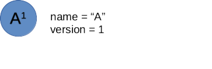
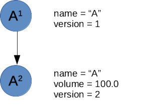
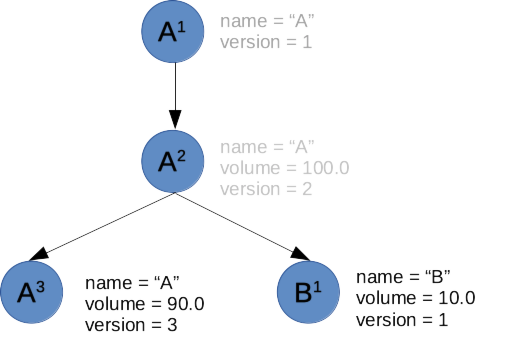
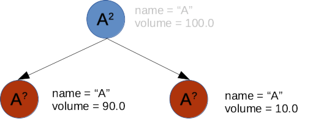

# WIP: This document will be a moving target until the release of v1.0

The core of any LIMS is managing samples and ensuring integrity of their data and ancestry. Great care has been taken to ensure that these principles are met in Common LIMS.

# Substances

Samples and Aliquots are specific instances of the generic type `Substance`. Substances can be:

    * Kept in a container
    * Merged together from several other substances (pooled)

Examples of `Substance`s are:

    * Original sample
    * Aliquot
    * Index tag (sequencing lab)
    * Pool
    * Solution used to dilute a liquid sample

# Auditing

The general rule is never to delete any data. Individual labs can of course decide to archive old samples if required, but (given that you backup your data) you should always be easily able to track the status of a sample in any state it has ever been in. The history of samples is maintained by creating new version of each of its properties on every change.

# Ancestry

Every sample is either an original sample or an ancestor of such a sample. Samples can keep their name when properties change, but then they'll always get a new version number (see the chapter on Auditing).

It's easiest to understand the sample lifetime by looking at an example.

## A sample enters the lab

```
# Example code:
a = Sample("A")
```



Here you have a single sample, named "A". It has version 1, since it has no parent.

## You change any property of the sample

```
a = self.substances.find("A")  # Since you don't specify a version, you'll get the latest
a.volume = 100.0
```



We now have two samples, both named A, but with different version numbers.

## You try to change an old version

This would fail, since you can never modify an old version of a sample:

```
a = self.substances.find("A", version=1)
a.volume = 100.0  # Throws a CannotModifyArchivedItemException
```

## You create an aliquot

You would now like to create an aliquot, taking 10% of the samples volume and adding it to another well.

The api supports two ways to do this. The straightforward:

```
b = a.copy("B")
b.volume = 10.0
a.volume -= 10.0
```

or this one liner, designed to make sure the developer doesn't forget to subtract from the parent:

```
b = a.transfer("B", volume=10.0)
```

This will also copy the sample and then make the change.

In any case, the ancestry now looks like this:



## Names change when you create an aliquot

The previous API calls (copy and transfer) require you to update the name of the sample before saving it. This avoids confusion about where a sample is coming from.

So if we would allow this:

```
copy = a.copy("A")
copy.volume = 10.0
a.volume -= 10.0
```

It would be difficult to know what version to apply to each:



So a new sample entity is created for the aliquot. Contrast this to when a property is changed, the sample identity remains the same.

# Pooling

Let's assume we' have two liquid samples that should be pooled together to make a `Pool`.

```
a = self.substances.find("A", "Sample")
b = self.substances.find("B", "Sample")

# We want to first create aliquots:
a_aliquot = a.create_aliquot(volume=10.0)
b_aliquot = b.create_aliquot(volume=5.0)

# Since we didn't specify a name, this creates an automatic name
# for the new aliquot that references the version of the parent: "A-v1-derived"
# You can create another naming convention by subclassing the Sample object.

# Both aliquots will now have exactly the same properties, except that the volume has been set
# explicitly.

# We'll now create a pool:
c = Pool(a_aliquot, b_aliquot)
c.save()

# You can fetch the properties of the pool via its parents:
print(c.parents[a_aliquot.name].volume)

# Alternatively you could have set properties on the pool based on the properties of the parents:
d = Pool(a_aliquot, b_aliquot, properties=a_aliquot.properties)
```
