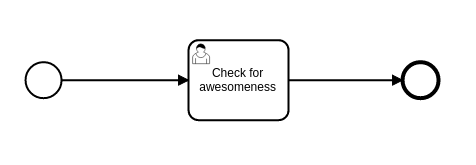

The core of any LIMS is managing samples and ensuring integrity of their data and ancestry. Great care has been taken to ensure that these principles are met in Common LIMS.

# Auditing

The general rule in Common LIMS is never to delete any data. Individual labs can of course decide to archive old samples if required, but (given that you backup your data) you should always be able to track the status of a sample in any state it has ever been in. The history of samples is maintained by doing a full copy of them in the database before editing them. This is common practice in many information systems that require strict audit logs. An alternative would be to maintain diffs of entered data or use an append-only database. We don't take that route here because it's in a sense more complex and much more difficult to handle GDPR requirements.

- Note that this decision comes at the cost of increased database size, but full audit logs that are simple to query were more deemed more important by us.

# Ancestry

In Common LIMS, every sample is either an original sample or an ancestor of such a sample. Samples can keep their name when properties change, but then they'll always get a new version number (see the chapter on Auditing).

It's easiest to understand the sample lifetime by looking at an example.

## The sample enters the lab

```
# Example code:
a = Sample("A")
```


Here you have a single sample, named "A". It has version 1, since it has no parent.

## You change any property of the sample

```
a = samples.find("A")  # Since you don't specify a version, you'll get the latest
a.volume = 100.0
```


We now have two samples, both named A, but with different version numbers.

## You try to change an old version

This would fail, since you can never modify an old version of a sample:

```
a = samples.find("A", version=1)
a.volume = 100.0  # Throws a CannotModifyArchivedItemException
```

## You create an aliquot

You would now like to create an aliquot, taking 10% of the samples volume and adding it to another well.

The api supports two ways to do this. The straightforward:

```
b = a.copy("B")
b.volume = 10.0
a.volume -= 10.0
```

or this one liner, designed to make sure the developer doesn't forget to subtract from the parent:

```
b = a.transfer("B", volume=10.0)
```

This will also copy the sample and then make the change.

In any case, the ancestry now looks like this:


## Names change when you create an aliquot

The previous API calls (copy and transfer) require you to update the name of the sample before saving it. This avoids confusion about where a sample is coming from.

So if we would allow this:

```
copy = a.copy("A")
copy.volume = 10.0
a.volume -= 10.0
```

It would be difficult to know what version to apply to each:


So a new sample entity is created for the aliquot. Contrast this to when a property is changed, the sample identity remains the same.

# Defining custom properties

Your LIMS implementation will very likely require custom properties that you require but are not required in all labs.

For details on how to create a custom plugin, refer to [the plugin documentation](./plugins.md).

## Example

You're a DNA sequencing lab and your scientists have implemented their own custom sample QC instrument which measures something they call the samples `awesomeness factor`. After this instrument has run, you need to save the resulting `awesomeness factor` with the sample so it can be be properly altered with another custom instrument which increases the sample's `awesomeness factor` if it's too low.

Since this is a sequencing lab, you might want to use the `Sample` from the core plugin `clims_plugin_genetics` which defines a sample with various sequencing related values. The developers of the core plugin didn't predict this requirement, so you need to inherit from it:

- Execute: `pip install clims_plugin_genetics`
- Create the file `your-plugin/models/sample.py`

Then open your plugin in your editor and create a `Sample` model:

```
from clims_plugin_genetics import models


class Sample(models.Sample):
    awesomeness_factor = models.FloatProperty(default=0)
```

Now create a UserTask class that uses this:

```
from clims_plugin import *


class MeasureAwesomenessUserTask(UserTask):
    @action("Create sample file")
    def create_sample_file(self):
        # Your instrument needs all the samples in a particular format
        instrument_file = self.create_file("instrument-file.dat")
        for container in self.input_container:
            for sample in container:
                instrument_file.write("{}: {} {}\n".format(sample.id, sample.volume, sample.concentration))

    @required_file_upload("Upload output file from the instrument")
    def upload_instrument_file(self):
        pass

    @action("Measure awesomeness")
    def measure_awesomeness(self):
        # This informs the user if the file hasn't been uploaded yet and stops execution in that case
        instrument_file = self.get_input_file(self.upload_instrument_file).as_csv()

        # The research engineer has uploaded the instrument file.
        for row in instrument_file:
            self.input[row.sample_id].awesomeness_factor = row.awesomeness_factor
```

Finally, create a workflow that does nothing but measure the awesomeness factor:

Refer to [the workflow documentation](workflow.md) more information on how to define workflow.

* Open `camunda-modeler` and create the file `your-plugin/workflows/awesome.bpmn`
* Create a diagram similar to this:



Make sure that the task is a `UserTask` and that the form key has the name `MeasureAwesomenessUserTask`.
